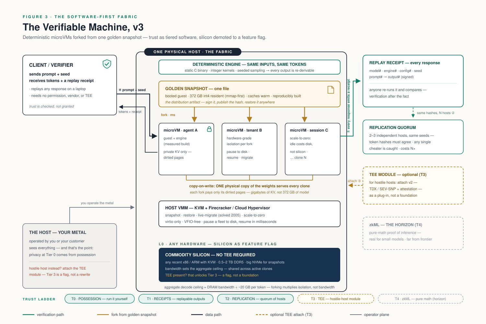

# The Verifiable Machine

## A Software-First Fabric for Frontier Inference: Deterministic MicroVMs, Replayable Trust, and Silicon as a Feature Flag

**Version 3.3 — August 2026**

**Jessie Hermosillo — terrazzo machines**

---

## Abstract

This paper is the third iteration of one design question: how do you run a frontier language model such that its privacy, integrity, and identity are *verifiable* rather than promised? Version 1 answered with GPU confidential computing and a composite attestation, and admitted the largest proprietary artifact in computing into its own trust boundary. Version 2 resolved that contradiction by deleting the accelerator: sparse Mixture-of-Experts arithmetic plus terabyte-class encrypted RAM made a CPU-pure appliance possible, with a single chain of hardware trust and a stack one person can read.

Version 3 interrogates the assumption both predecessors shared: that trust must be rooted in physics at all. Hardware attestation exists to solve exactly one problem — convincing a *stranger* while a *hostile host* watches. Audit the actual deployment landscape and that configuration is one tier among several, not the foundation: most real deployments are self-hosted or customer-hosted, where the operator is inside the trust story by construction. For every tier below outright host hostility, the guarantees can be carried entirely in software, and more cheaply: **deterministic inference** makes every output re-derivable, so a signed *replay receipt* — model hash, engine hash, configuration hash, seed, prompt hash, output hash — lets anyone verify any response after the fact on commodity hardware; **replication** across independent hosts bounds cheating by quorum; and zero-knowledge inference waits at the horizon as the pure-math endgame. The trusted execution environment is thereby demoted from foundation to *module*: a feature flag attached only for the hostile-host tier, where v2 survives intact as a plug-in.

Removing the hardware-trust foundation has a second, compounding payoff: it resurrects everything the GPU era had killed. A CPU-pure guest has no unsnapshottable device state, so the microVM's classic superpowers return whole — a warm, fully-loaded frontier model becomes a *golden snapshot*, one signed file; forks of it share a single physical copy of the weights through copy-on-write memory, paying only their own KV cache; live migration is twenty-year-old technology again. The resulting architecture is one sentence long: commodity metal → microVMs forked per agent or tenant from a golden snapshot in milliseconds → a deterministic engine inside → replay receipts out. Frontier possession, hardware-grade isolation per fork, verification without permission — and the physics requirement reduced to "a computer exists."

*Revision note: v1 (GPU throughput branch) and v2 (CPU-pure TEE appliance) remain documented; v2 is incorporated here, whole, as the Tier-3 module. This document supersedes both as the reference architecture, and is the project's single public document — contributions (§1.1), the governing arithmetic with measured constants (§2.4), the instrument-and-refusal record (§5.1), and the measured tables are all here rather than scattered. v3.2 folded in the repository's measured campaign — five architecture families token-exact, the 744B replay-wall ladder, receipt signing — plus a related-systems survey (§2.3) and scope corrections from an adversarial pre-publication review.*

---

## 1. Introduction: What Was the Hardware For?

The prior versions of this paper inherited, without examining it, the framing of the confidential-computing literature: the operator is adversarial, the client is remote, and therefore the guarantee must live below software — in memory encryption, fused keys, and attestation reports signed in the die. Within that framing, v2's design is (we still believe) close to optimal. But the framing itself deserves the audit this version performs.

Hardware roots of trust purchase exactly one thing software cannot: a guarantee that holds *against the machine's own operator, in real time, for a verifier who was never present*. That is the correct purchase for a public inference service selling to strangers, for hostile-jurisdiction deployment, for weight custody on rented metal. It is the wrong default for everything else. The team running open weights on servers they own is defending against nobody in their own machine room. The vendor deploying an appliance into a customer's data center has an operator — the customer — who is a party to the transaction, not an adversary lurking beneath it. The agent fleet on a single box needs isolation *between agents*, not proof *against its owner*. In each of these, v2's architecture spends its most expensive properties — TEE hardware requirements, attestation infrastructure, sealed-state operational constraints, the residual side-channel anxiety — solving a threat that is not present.

The audit yields the reframing this paper is built on: **trust is not a foundation but a ladder**, and each rung should be paid for only where its threat actually exists. The rungs, developed in §3: possession (run it yourself — the guarantee is physical), receipts (any output can be replayed and checked by anyone, after the fact), replication (independent hosts must agree), hardware attestation (the hostile-host module — v2, attached as a flag), and zero-knowledge proof (the pure-math horizon). The first three rungs are software. And the moment the architecture stops *requiring* physics, a cascade of capabilities the hardware-trust framing had suppressed comes back online — which is the subject of §2 and the engine of the whole design.

### 1.1 Contributions

Stated explicitly, and each carried by artifacts in the companion repository rather than by assertion:

1. **Per-response signed replay receipts at measured frontier scale.** Every generation emits a signed record binding engine, model, configuration, seed, prompt, and output hashes; an independent verifier re-derives the answer and checks hash equality. A 32-system survey (§2.3) found this quadrant — exact per-response verification by re-execution, on anyone's commodity hardware, shipped and measured at 744B–1T scale — otherwise unoccupied: zkML proves without re-execution far below this scale; TEEs attest *which stack ran*, never what it computed; per-file central validation proves a build, not a response.
2. **Residency-invariance as a provable property.** Weights are memory-mapped and read-only; residency is an emergent property of the host. The receipts are demonstrated invariant under paging, expert streaming, thread count, power profile, core class, engine generation (output-hash reproduction across rebuilds), and ISA — so *insufficient resources reduce speed but can never silently redefine the model*. This converts the folk claim "mmap lets big models run" into a checkable identity statement.
3. **The possession economics of sparse frontier models, measured.** A 1.026-trillion-parameter model minted, spoken, signed, and replay-verified on a 64 GB laptop, with the active-parameter clock law measured rather than argued: ~8.7 s/token at 1.026T total (31.7B active) versus ~19 s/token at 743B (40.1B active) — the clock follows the slice that thinks (§2.4).
4. **Receipt-preserving speculation, including its refusals.** Greedy speculative decoding — n-gram, model-native MTP, and truncated-routing self-drafting with an acceptance governor — implemented such that the emitted stream is provably the plain-greedy stream. The speed gates that *refused* (both scales, pre-registered thresholds, mechanisms identified by the engine's own phase counters) are published with the same prominence as the gates that passed: refusal-with-mechanism is treated as a deliverable (§5.1).
5. **An instrument-first performance culture with an energy program.** Phase counters, teacher-forced acceptance scoring, routing-truncation diagnostics, and a battery-path energy meter (joules per verified token beside the output hash — a number no cloud provider can prove and no local tool currently publishes) gate every optimization claim before it ships.

One inheritance from v1 and v2 is preserved unamended: the legibility principle. A guarantee — cryptographic, procedural, or replicative — is only worth what the auditability of the guaranteed stack makes it worth. v3's stack is smaller than either predecessor's, because it deletes not only the accelerator but, for most tiers, the attestation machinery too.

---

## 2. Background: What Carries Over, and Two New Enablers

Three findings from v2 carry forward unchanged and are only summarized here. The *sparsity dividend*: frontier open models are sparse Mixture-of-Experts systems, and sparsity splits a token's cost across three ledgers this paper refuses to blur. **Arithmetic** follows *active* parameters — a 744B-parameter model computes each token with ~40B (40.1B, derived from GLM-5.2's shipped configuration: 78 layers, 256 routed experts, 8 routed + 1 shared active; the 1.03T Kimi K2.6 computes with 31.7B of its 1.026T by the same derivation), putting decode memory traffic near 20 GB rather than 400. That is the design's point, not a gotcha: per-token compute and bandwidth are active-class *by construction*, total parameters buy routed conditional capacity, and quality claims belong to the upstream release, not this paper (§6's boundary of meaning). **Residency** follows *total* parameters: which ~40B computes is re-decided at every layer of every token by routing over every expert's gate, so the full model must be present, addressable, and bit-exact for the choice to be the model's own — a sparse trillion is not "really a 32B model"; the machine must possess the library it thinks with. And **the clock**, on hosts with less RAM than model, follows *expert locality* — how much of each token's chosen slice is already warm — which the engine measures (streamer get-wait telemetry, docs/mac-lane.md) rather than letting the active-parameter number imply a residency it never promised. The *possessable frontier*: open-weight releases at 744B (GLM-5.2 — 468 GB as this repository's minted q4 container), 975B (Inkling), 1.03T (Kimi K2.6, INT4 QAT — minted, spoken, and replay-verified through this repository's supply line: 602 GB on a 64 GB laptop), and 2.8T (Kimi K3, 1.6 TB native MXFP4) put models worth this architecture into anyone's hands. And *terabyte commodity RAM*: 12–24 DDR5 channels per box, half a terabyte to over a terabyte per second aggregate, capacities to several TB — enough to hold the model fully resident, deleting the streaming machinery for specified hardware (v3.1 realized this as mmap-first: the machinery is deleted, the capability is not — memory-mapped weights with OS paging are standard practice, normalized when llama.cpp made mmap its default loading path [12]; what this design adds is that receipts and tokens are provably *invariant* under paging — residency changes timing, never identity — plus a deterministic expert streamer whose failure mode is a loud fallback, never a different value). The measured public floor remains the colibrì lineage's: interactive decode of the 744B model on a two-channel desktop, with server-class boxes projected at several to ~20 tokens/second (v2 §7). *(The repository has since added its own measured floor on a 64 GB laptop — §7 and docs/mac-lane.md.)* Two enablers are new to v3.

### 2.1 Determinism as an achievable engineering property

Verification-by-replay (§3) requires that the same inputs produce the same tokens — bit-identical, across runs and across machines. On GPU serving stacks this is genuinely hard: floating-point reduction order varies with batching and kernel selection, and nondeterminism remains the documented default — batch-invariant kernels have since demonstrated run-to-run determinism as an opt-in mode on a fixed stack and GPU [15]. That property is per-stack and hardware-bound; verification-by-replay on anyone's machine needs the stronger one — bit-exactness across vendors and ISAs — and on a self-authored CPU engine the stronger property is a *choice*: integer-quantized weights with fixed-order accumulation, exactly-specified sampling arithmetic, no cross-request batching inside a clone, single defined threading reduction. The open-engine lineage has already normalized the required culture — token-exact validation against a reference implementation, semantics that never silently change with resources — and v3 promotes bit-exact determinism from a testing convenience to a *product requirement*, versioned and hash-bound: a given (engine build, model container, config) triple defines a pure function from (prompt, seed) to token sequence. Cross-ISA exactness (x86 vs ARM) is an engineering program rather than a given, and is treated honestly in §5 and §8.

### 2.2 The GPU-free microVM dividend

Version 1's open-problems section catalogued four unsolved frontiers of GPU-era infrastructure: snapshotting device state, copy-on-write forking of warm models, live migration, and engine-native checkpointing. Delete the GPU and three of the four collapse into *existing Linux behavior*. A CPU-pure guest's entire state is memory plus a handful of virtio devices, which is precisely what microVM snapshot support was built for: pause, serialize, restore — including a guest holding 468 GB of resident weights. Restored clones map the same snapshot memory file privately, so the host page cache holds **one** physical copy of the weights while each clone's writes — its KV cache, its scratch — copy-on-write into private pages: the "fork a warm frontier model" problem that constitutes an open research program on GPUs is, on CPUs, approximately an `mmap` flag. And live migration of VM memory has been production technology since 2005. The capabilities that made microVMs interesting in the first place — millisecond starts, density, snapshot-as-artifact, scale-to-zero — return at frontier scale, and §4 builds the architecture directly on them.

### 2.3 Related systems

Both halves of this design now have neighbors, and honesty about them sharpens the claim rather than diluting it. *Storage as memory hierarchy* is becoming table stakes. Research established the pattern — [FlexGen](https://arxiv.org/abs/2303.06865)'s LP-scheduled GPU/CPU/disk aggregation, Apple's ["LLM in a flash"](https://arxiv.org/abs/2312.11514) windowed paging, [PowerInfer](https://github.com/SJTU-IPADS/PowerInfer)'s hot-neuron placement, [MoE-Infinity](https://github.com/EfficientMoE/MoE-Infinity)'s activation-traced expert offload, [DeepSpeed ZeRO-Inference](https://www.deepspeed.ai/2022/09/09/zero-inference.html)'s layer streaming — and consumer-hardware engines now ship it: [Flash-MoE](https://github.com/danveloper/flash-moe) streams a 397B MoE's routed experts from SSD on a 48 GB MacBook, [moe-stream](https://github.com/GOBA-AI-Labs/moe-stream) runs 80B models on a 24 GB Mac, [SwiftLM](https://github.com/SharpAI/SwiftLM) serves 100B+ MoE on Apple Silicon, [kTransformers](https://github.com/kvcache-ai/ktransformers) splits experts to CPU behind ISA-specialized kernels, and llama.cpp carries an [open pull request](https://github.com/ggml-org/llama.cpp/pull/25294) for O_DIRECT expert streaming. None of these makes a determinism, bit-identity, or per-response verification claim (the llama.cpp PR self-asserts bit-identity for one unmerged path), and several derive their speed precisely from ISA-specialized fast paths — the opposite design point from cross-ISA identity.

*Verified inference*, meanwhile, splits by trust mechanism. Zero-knowledge systems prove without re-execution but far from frontier scale and cost ([EZKL](https://github.com/zkonduit/ezkl); [zkLLM](https://arxiv.org/abs/2404.16109) at 13B with minutes of GPU proving per response; [DeepProve](https://lagrange.dev/blog/deepprove-1)); optimistic protocols make re-execution a challenge game with cryptoeconomic assurance ([opML](https://github.com/ora-io/opml) [18], [VeriLLM](https://arxiv.org/abs/2509.24257), [Ambient](https://ambient.xyz)); TEE attestation proves *which stack ran*, never what it computed, and roots trust in the silicon vendor ([Phala](https://phala.com/), [Tinfoil](https://tinfoil.sh), [EQTY](https://www.eqtylab.io/blog/verifiable-compute-press-release)); and the determinism ingredient alone is arriving on GPU stacks as a per-stack, single-vendor property with no verification artifact attached (Thinking Machines' batch-invariant kernels [15]; [vLLM](https://docs.vllm.ai/en/latest/features/batch_invariance/) and [SGLang](https://www.lmsys.org/blog/2025-09-22-sglang-deterministic/) deterministic modes; an unmerged [llama.cpp CUDA draft](https://github.com/ggml-org/llama.cpp/pull/16016); Microsoft's [LLM-42](https://arxiv.org/abs/2601.17768) replay verifier as internal machinery). The nearest relatives each hold one piece: [TOPLOC](https://www.primeintellect.ai/blog/toploc) [16] commits to activations and verifies within floating-point *tolerance thresholds*, tolerating engine nondeterminism that this design removes instead — hash equality, no similarity metric; Verde/RepOps [17] pursues the same bitwise reproducibility at the operator-library level rather than as a whole-artifact engine+model+config contract; [EigenAI](https://arxiv.org/abs/2602.00182) pairs determinism with re-execution but requires replays on the same fixed GPU architecture; [CommitLLM](https://commitllm.com/) adds research-stage receipts *over* a nondeterministic serving stack; and [Camelid](https://github.com/timtoole02/camelid)'s evidence-backed compatibility validates each supported model file token-for-token against a pinned llama.cpp — ahead-of-time, per-file, centrally — where this design verifies per-response, cryptographically, by anyone. The quadrant this paper occupies — per-response signed receipts, replayed to hash equality on anyone's commodity hardware, shipped and measured at 744B scale — is, as far as this survey found, otherwise unoccupied.

### 2.4 The arithmetic of the machine

The claims above reduce to a small set of equations, each with measured constants.

**Active parameters (sparse MoE).** For hidden size d, L layers, E routed experts of intermediate size m with k_r routed + k_s shared active, dense layers of intermediate f, and vocabulary V:

```
active/token ≈ L·A_attn + Σ_dense 3·d·f + Σ_moe [ (k_r + k_s)·3·d·m + d·E ] + d·V
```

Worked from shipped configurations (not model cards): GLM-5.2 → 40.1B active of 743B total; Kimi K2.6 → 31.7B active of 1.026T. Per-token cost follows the first number; possession requires the second.

**The three ledgers of a token.** Arithmetic follows *active* bytes; residency follows *total* bytes; the clock, on hosts with less RAM than model, follows *expert locality*:

```
s/token ≥ max( bytes_active / BW_compute , bytes_cold / BW_ssd )      (+ door/N)
```

Measured constants on the reference laptop: BW_ssd ≈ 7.4 GB/s (pread pool; the mmap fault path measures 0.95 GB/s — the streamer's reason), q4 kernel BW_compute ≈ 32.8 GB/s hot. The door (identity hash + open: 274 s for the 602 GB trillion) divides by N answers under the daemon — measured 92 s → 28 s per answer at 120B scale.

**The receipt as a pure function.** For a fixed triple (engine hash, model hash, config hash), generation is a pure function T = F(prompt, seed); verification is re-derivation plus equality: accept iff H(T′) = H(T) and the ed25519 signature validates. Determinism is what makes the receipt a proof rather than a log entry; §5's contract lists the implementation obligations that purchase it.

**Speculative decoding, bounded honestly.** With draft cost ratio c (draft step ÷ target step) and per-cycle accepted count a over draft depth k:

```
speedup = E[a + 1] / (k·c + 1),      lim k→∞ ≤ 1/c
c_selfdraft = (S + E_bytes·k_draft/k_full) / (S + E_bytes)
```

where S is the per-token spine (attention + norms + head) and E_bytes the expert traffic. Both refusals in the repository are worked examples: at 120B, teacher-forced acceptance measured 87.5% at half-routing, but c ≈ 0.6 paid drafts lost to the engine's existing zero-cost n-gram drafts (26 s → 35 s, gate refused). At 1T, the phase counters measured S = 2.53 s of the 6.54 s token — c = 0.54, not the ~0.33 assumed — and the gate refused (481 s → 618 s): *speculation cannot rescue a model whose spine is the cost.* The instrument that caught both (per-phase nanosecond counters) ships in the engine.

**Energy.** E/token = P_wall × t. The measured 120B decode budget (~26 J/token at ~52 W) decomposes into DRAM traffic (~0.1–2 J), arithmetic (~0.6 J), SSD (~0.4 J), platform static (7.8 W × t), and a scheduling residual of 19–21 J — 75–80% of every token — that is entirely software-addressable, since identical work measured 13.5× cheaper on efficiency cores. The floor at any speed is `7.8·t + traffic`; the engine's power profiles (battery- and thermal-sensing, §5.1) trade t against P without moving a value, and the battery-path meter prices every profile in joules beside the receipt.

**Fork economics (the fabric).** A restored clone shares one physical copy of the weights copy-on-write; its marginal cost is dirtied pages only. Measured at reduced scale on real Firecracker: 13 ms fork→resume, ~110 MiB marginal per clone, 0.7 ms pause/resume. Because weights are mmap-first, a golden snapshot excludes them — guest RAM only — so snapshot-as-artifact survives frontier scale by construction.

---

## 3. Trust, Re-Tiered: The Ladder

Each tier is defined by the adversary it answers, what it costs, and what it cannot do. Tiers compose upward; deployments attach the highest rung their threat model actually requires.

**Tier 0 — Possession.** You run the machine. Privacy is physical: unplug the network and it is absolute; the operator problem is vacuous because the operator is you. This tier's guarantee is the strongest available anywhere and costs nothing but the hardware. It is also, honestly, the tier at which a maxed unified-memory workstation (a 512 GB Mac Studio holds the 744B model fully resident at ~800 GB/s) is a legitimate sovereign instance. What T0 cannot do: convince anyone else of anything.

**Tier 1 — Replay receipts.** Every response ships with a small signed record: schema version; the model container hash; the engine build hash (reproducible-build program specified; its ceremony pending, §10); the configuration hash (sampler parameters, token budget, stop condition); the seed; the prompt hash; and the hash of the emitted token-ID sequence. Templates and tokenization sit outside the receipt boundary — the prompt hash binds token IDs, which the client produces — until the tokenizer moves in-engine. Because the engine is a deterministic pure function, the receipt makes the response *re-derivable*: any party holding the prompt — the client holds their own — obtains the hash-matched weights and engine, replays, and compares token hashes. A mismatch is cryptographic evidence of deviation: a swapped model, an altered system prompt, a tampered engine. The verifier needs no TEE, no vendor relationship, and no permission — and, decisively, no exotic hardware: the streaming-engine lineage means a laptop with a large SSD can replay a 744B response, slowly but conclusively (measured: 10m44s for a 24-token golden on a 64 GB laptop, §7). What T1 buys is *integrity and identity, after the fact*, with deterrence economics: an operator who cannot predict which responses will be audited must be honest on all of them. What T1 cannot do: prevent deviation before it happens, or hide the prompt from the host — at this tier the host is trusted for confidentiality by construction, and privacy remains a possession property.

**Tier 2 — Replication quorum.** For integrity that does not wait for audits: the same (prompt, seed) is executed on two or three operationally independent hosts, and token hashes must agree before the response is accepted. Any single cheating or compromised host is caught in-line; collusion of all replicas is the residual. Cost is the honest multiplier — N× compute — which the appliance economics of this architecture (commodity boxes, not accelerator pods) make tolerable for high-stakes workloads. T2 likewise adds nothing for confidentiality.

**Tier 3 — The TEE module.** When the host itself is the adversary — public services for strangers, hostile jurisdictions, weight custody on rented metal — software rungs end and physics begins, and here Version 2 is not superseded but *packaged*: the CPU-pure confidential VM, single-vendor attestation chain, measured stack, and attestation-gated key release attach to the fabric as a deployment flag on TEE-capable hosts. Everything in v2's threat model, performance analysis, and limitations applies within this module unchanged. The demotion is architectural, not technical: T3 is a rung for the deployments that need it, not the foundation everything else must stand on.

**Tier 4 — The horizon.** Zero-knowledge machine learning is the pure-math endgame: a cryptographic proof that *this model produced this output*, verifiable by anyone, trusting no hardware and no replicas — the only rung that could ever prove without re-executing or attesting. It is real today for small models and remains orders of magnitude from frontier scale; the architecture reserves its slot (a receipt field for proof attachments) and makes no promises on its schedule.

The sentence that organizes the whole version: **silicon is demoted from foundation to feature flag.** Physics did not leave the stack; it moved to the rung where its cost is justified.

---

## 4. The Fabric Architecture

Figure 3 shows the system. It is no longer a single sealed boundary but a *fabric*: one physical host manufacturing isolated frontier instances on demand, with verification as an external, permissionless plane.



***Figure 3.** The software-first fabric. One commodity host runs a golden snapshot — a booted guest with the full model resident and warm, reproducibly built, its hash published. MicroVMs fork from it in milliseconds (①-adjacent gold fan), sharing one physical copy of the weights via copy-on-write and paying privately only for their dirtied pages. Inside each clone, the deterministic engine turns (prompt + seed) into tokens plus a replay receipt (①), which anyone can re-execute and check (the verification plane, right): receipts for after-the-fact integrity, a replication quorum for in-line integrity (②), the TEE module attachable for hostile hosts (③), zkML reserved at the horizon. The host is drawn in neutral, not adversarial, tones — at the base tiers the operator is a party to the system, and the trust ladder along the bottom prices each stronger assumption separately.*

### 4.1 The host layer: any hardware

The platform is a commodity server — any recent x86 or ARM part with KVM — sized by the v2 rules: RAM to hold the target model fully resident (512–768 GB for the 744B class; ~2 TB for the largest checkpoints), memory channels as the throughput budget, and generous NVMe for snapshot storage. No TEE is required; a TEE's *presence* unlocks Tier 3 on the same box. The one physics fact that survives every tier: aggregate decode throughput is still DRAM bandwidth over bytes-per-token, *shared across active clones* — forking multiplies isolation and tenancy, never bandwidth.

### 4.2 The VMM layer: the returned superpowers

KVM plus a minimal VMM — Firecracker or Cloud Hypervisor, VFIO-free — provides the fabric's verbs: snapshot a running guest to a file; restore clones from that file with lazily-mapped, copy-on-write memory; pause fleets to disk and resume them; live-migrate between hosts using mechanisms two decades old. These are not aspirations; they are the documented, GPU-blocked-no-longer capabilities the platform layer has had all along.

### 4.3 The golden snapshot: model-as-artifact

The unit of distribution and of startup is one file: a guest image — minimal kernel, dm-verity rootfs, the static engine — *booted*, the full model loaded resident, caches warm, then frozen. Build it reproducibly, sign it, publish its hash to a transparency log; the artifact plays the role attestation measurements played in v2, but as a property of a file anyone can rebuild and check rather than of a live report only hardware can sign. Cold-starting a frontier deployment stops meaning "load 468 GB and warm up" and starts meaning "restore this snapshot" — and shipping a frontier appliance to a customer means shipping (or letting them rebuild) this file.

### 4.4 Fork mechanics: one copy, many machines

Clones restore from the golden snapshot with guest memory mapped privately from the shared snapshot file. The host page cache therefore holds a single physical copy of the weights serving every clone; each fork's private cost is only what it dirties — its KV cache (MLA-compressed state runs to a few kilobytes per token, so even long sessions cost single-digit gigabytes), guest-kernel working pages, scratch. The arithmetic that follows is the fabric's economic core: a 768 GB box carries the 468 GB model *once* plus on the order of dozens to hundreds of concurrently-resident sessions bounded by KV, not by weights — with hardware-grade VM isolation between every pair (projected from measured mechanics — the reduced-scale fork table of bench/results-laptop.md — not yet measured at frontier scale). Fork latency is snapshot-restore latency: milliseconds to a running clone against a page-cache-warm image, with untouched pages faulting in lazily; the 40-second weight-load exists once per host lifetime, not per instance. Idle clones pause to disk and cost nothing; the fleet scales to zero.

Per-agent and per-tenant isolation — the property GPU serving stacks approximate with software schedulers — is here the default physical arrangement: every agent, session, or tenant is its own kernel behind its own VM boundary, disposable after use, forkable mid-conversation (snapshot a clone, and its KV state becomes a branchable artifact: the tree-search and time-travel patterns v1 could only propose for GPUs fall out of the same two verbs).

### 4.5 Inside a clone: the deterministic engine

Each microVM runs the v2-lineage guest — tiny Linux (unikernel at the frontier), read-only verified rootfs, no interactive pathways — around the static engine: a few thousand lines of C implementing the sparse forward pass over *mmap-first weights* with the determinism contract of §5 — the container is mapped read-only, so residency is an emergent property of host RAM: fully resident on the fabric host, OS-paged on smaller machines, with identical tokens and receipts either way, since paging changes timing and never values. The clone's interface is minimal: prompt and seed in over virtio-net, token stream and receipt out. TLS terminates inside the clone at Tier 3; at lower tiers the fabric's network posture is the operator's policy, honestly stated.

### 4.6 The verification plane

Receipts emit with every response and are the client's to keep; a verifier CLI replays them against hash-matched artifacts. Replication, when attached, is a thin coordinator dispatching identical (prompt, seed) to independent fabrics and comparing token hashes before release. The TEE module, when attached, wraps clones in the v2 confidential envelope with attestation-gated key release. Nothing in the plane requires the fabric's permission to operate — which is the point.

---

## 5. Determinism as a Product Requirement

The receipt is only as strong as the engine's purity, so v3 elevates determinism to a specified, tested, versioned property. The contract: for a fixed (engine build hash, model container hash, configuration hash), the mapping (prompt, seed) → token-ID sequence is bit-exact across runs, hosts, and thread counts. The implementation obligations are concrete and all CPU-tractable: integer weight formats with fixed-order floating-point accumulation — FMA contraction disabled (`-ffp-contract=off`), libm transcendentals replaced by an IEEE-basic-ops implementation (det_math.c) — with full-integer accumulation an explicitly open item (§8.2); attention arithmetic specified to the operation; greedy decode as the shipped, receipted path, with seeded top-k sampling a provisional versioned implementation (`prng: splitmix64-v0`) pending its fixed-point specification; no cross-request batching within a clone (batching lives, if anywhere, at the fabric layer where it cannot perturb a session's arithmetic); threading schemes whose reductions are order-fixed. Validation is continuous: token-exact replay tests across machines in CI, and the reference-oracle discipline inherited from the open-engine lineage.

Two honest boundaries. Cross-ISA bit-exactness (x86 ↔ ARM) is achievable for the fixed-order core but must be *demonstrated*, not assumed — until it is, receipts bind the ISA family alongside the engine hash, and replays match like-for-like. *(Since demonstrated in the repository at three scales: the 12-cell kernel matrix — scalar/AVX2/NEON × fp32/q8/q4 — bit-identical across x86_64 and aarch64, native and emulated; tiny end-to-end generation likewise; and a real published golden — the TinyLlama receipt 74f5fd — replayed hash-identical by an x86_64 engine build under Rosetta 2 emulation; docs/determinism.md. Native-silicon replays of the frontier goldens are the remaining step, and the `isa` field remains as a scope declaration.)* And determinism constrains performance engineering: some fast paths (opportunistic batching, atomics-based reductions) are excluded by construction, a tax the §7 numbers absorb. The tax buys the entire Tier-1/Tier-2 trust story; v3 pays it without apology.

### 5.1 The instruments, and refusal as a deliverable

Determinism makes optimization safe; instruments make it honest. The engine carries its own measurement surface, all receipt-neutral: per-phase nanosecond counters (attention / MoE / dense / head per decode token — the split that arbitrated both speculation refusals and exposed that a coarser span had aimed one optimization at the wrong cost); teacher-forced acceptance scoring (one batched pass over a golden stream yields one true acceptance sample per position — 64 per weight sweep — replacing anecdote with a curve); routing-truncation diagnostics (loudly non-receiptable by construction); thread/ISA/kernel equivalence suites run on every push; and a battery-path energy meter with dual independent integration paths that refuses to measure on AC power because charge flow masquerades as load.

The cultural rule these instruments enforce: a performance claim ships only behind a pre-registered, falsifiable gate, and a refused gate is published with its mechanism at the same prominence as a passed one. The repository's ledger currently carries both kinds — the daemon's 92 s → 28 s and the 744B's 41m53s → 10m44s beside two speculation refusals and one scheduling revert whose post-mortems are written into the source as scars. A system whose entire thesis is verifiability earns nothing from unverifiable speed claims about itself.

---

## 6. Threat Model, Per Tier

Stating each rung's adversary and residuals plainly. **T0:** adversaries are external attackers and physical intruders; defenses are ordinary system security plus, at the limit, the air gap. No claim is made to anyone else. **T1:** the adversary is a *deviating operator* — model substitution, prompt tampering, engine modification; the receipt detects all three after the fact with cryptographic force, and deters by audit unpredictability. Residuals: no prevention, no confidentiality against the host, and verification requires the prompt (the client audits their own traffic; third-party audit requires disclosure, until T4). One further residual named plainly: the receipt binds a seed *value*, not its *provenance* — at temperature above zero an operator may sample several seeds and sign only the preferred run, so receipts prove derivation, not sampling neutrality; deterrence covers substitution and tampering, not seed selection. (All published goldens are greedy and immune; schema v2 closes this by binding the client-supplied seed, or deriving it as a hash of prompt and client nonce, so the operator has no seed-selection freedom.) **T2:** the adversary is any single compromised or cheating replica; residual is full-quorum collusion and the N× cost. **T3:** the adversary is the host itself, and the model is v2's, imported whole — including its residuals: CPU TEE side channels mitigated-not-closed, TEE implementation vulnerabilities answered by fast re-attestation on a small stack, metadata visibility, and the boundary of meaning (attestation binds *which* model, never how good). **Multi-tenant, any tier:** deployments inherit the standard cross-VM side-channel posture — SMT off or core scheduling, per-tenant CPU pinning; shared read-only weight pages leak nothing (a public artifact), while KV pages remain private by copy-on-write construction. **All tiers:** the weights are the irreducible rental — a mind trained elsewhere, trusted on the releasing lab and the checksum; and no rung anywhere makes any claim about model *behavior*, only model *identity*.

The composition rule that keeps deployments honest: name the strongest adversary actually present, attach that rung, and state the residuals of that rung — a system sold at T1 must say "integrity after the fact, privacy by possession," and nothing grander.

---

## 7. Performance and Economics of the Fabric

The single-clone physics is v2's unchanged: decode ceiling ≈ effective DRAM bandwidth ÷ ~20 GB per token for the 744B class; measured floor 1.8 tok/s on a two-channel desktop; estimated 8–15 tok/s sustained on a 12-channel socket and 15–25 on a NUMA-tuned dual socket, pending the Phase-1 measurements this lineage requires before promising. *(The repository's own measured rows now bracket these from below, on a 64 GB laptop: Mixtral-8x7B q8 decodes at 3.8 tok/s warm; DeepSeek-V2-Lite q8 at 11.7; gpt-oss-20b q8 at 2.6, signed and replay-verified in 90 s (golden 0dc86d); gpt-oss-120b q4 — 70 GB, larger than RAM, minted through the wire — speaks its first words in 4m13s cold and replay-verifies in 4m46s (golden f5668f); and GLM-5.2 q4 — the 744B class itself, at 7× RAM — speaks through mmap paging with its receipt verified by offline replay: 41m53s at first minting, 10m44s after the expert streamer and the threaded 32-wide q4 kernels, the same golden 993fd1 at every rung; docs/mac-lane.md. And the 1.03T checkpoint — Kimi K2.6, 602 GB at 9.4× RAM — has spoken: first words in 558 s after a 274 s identity door paid once per daemon lifetime; warm answers now measure 468–481 s for 64 tokens, bit-identical across engine generations; golden 149fd339 signed and replay-verified. The active-params claim is measured, not argued: ~8.7 s/token at 1.026T total versus ~19 s/token for the 744B, because each token computes with 31.7B versus 40.1B — the clock follows the active slice. Its decode anatomy is likewise on the record — attention 1.9–2.0 s, experts 4.0–4.4 s, head 0.3 s per token — which is why the paper's next optimization target is the spine, and why it says so with a receipt rather than a roadmap adjective.)* What v3 adds is the *fleet* dimension, and its numbers are the architecture's argument.

Marginal cost per instance collapses from "a machine" to "a session's dirtied pages": with weights shared copy-on-write, an additional agent costs single-digit gigabytes of KV and kernel pages — so instance count is bounded by RAM headroom and, operationally, by *bandwidth sharing*: concurrently-decoding clones divide the socket's tokens/second among themselves. The honest fleet equation is therefore: hundreds of *resident* sessions, a handful of *simultaneously active* ones at interactive speed, scheduled by the fabric — a shape that fits agent fleets (bursty, mostly idle) and multi-tenant assist workloads (think-time-dominated) far better than it fits high-QPS chat serving, which remains the GPU branch's territory. Fork latency is milliseconds-class against warm images; scale-to-zero is real (paused clones cost NVMe, not silicon); and the receipt overhead is a rounding error — hashing tokens and signing a record. Replication multiplies cost by its quorum, priced in the open. The trillion-parameter row prices the fleet claim's three clauses exactly: the 64 GB laptop is where 1.03T becomes *provable* (measured above); a memory-resident appliance is where it becomes *resident* — and residency exposes the next wall, the kernel's own measured 32.8 GB/s against ~20 GB of active q4 weights per token, roughly 1.6 tok/s — so the kernel program (§8) is where it becomes *conversational*. The receipt is identical in all three places: a structural property today (row-parallel kernels have no cross-thread reductions to reorder, so thread count and core class are proven outside receipt identity in CI), and §8.2's cross-device frontier replay is the gate that carries it to appliance scale. The capital comparison carries from v2 and sharpens: the fabric's host is a memory-heavy commodity box at an order of magnitude below the multi-accelerator node required to hold a frontier model in device memory, and *one* such box now does the isolation work that GPU architectures spend schedulers, sandboxes, and unsolved research problems approximating.

---

## 8. Open Problems

Ordered by leverage. **8.1 Fabric-aware bandwidth sharing.** Per-VM isolation forbids cross-tenant batching, so concurrent clones each traverse the (shared, physically single) weights independently; a host-mediated read-only weight segment with staggered token clocks could recover batched bandwidth efficiency across isolation boundaries without perturbing any clone's determinism — unclaimed, and worth a multiple of sustained throughput. **8.2 Cross-ISA determinism and the integer core.** Full-integer accumulation (today the engine accumulates in exactly-ordered float with contraction disabled) and validating bit-exact inference across x86 and ARM (and unified-memory prosumer hardware) widens the verifier base to every laptop. *(Since demonstrated at three scales — the 12-cell kernel matrix, tiny end-to-end, and a real published golden replayed hash-identical by an x86_64 build under Rosetta 2; docs/determinism.md. Receipts keep `isa` as a scope declaration; native-silicon frontier replays and the integer core are the open remainder.)* **8.3 Huge-snapshot ergonomics.** 0.4–1.6 TB golden images need content-addressed, deduplicated, incrementally-updatable storage and transfer — snapshot-as-artifact deserves its own OCI-registry moment. **8.4 Receipt standardization and the verifier ecosystem.** A schema, a CLI, transparency-log conventions, and third-party audit services are what turn T1 from a feature into an institution; the entire tier is sociotechnical leverage on a few hundred lines of code. Artifact availability is a named sub-problem: publish containers (or demonstrate machine-independent deterministic minting from upstream releases), archive per-release engine binaries keyed by hash, and price the verifier's true costs — bandwidth and hours, not just compute — next to the measured replay walls. **8.5 KV branching and prefix sharing.** Snapshot-forked conversations create trees of KV state; deduplicating shared prefixes across clones (without breaching isolation) compounds the density story. **8.6 The T3 seam.** Porting the fabric's fork-and-snapshot verbs *into* the TEE module collides with sealed-state design (instance-bound keys are the point of CVMs); confidential fork/restore between mutually attested endpoints is the open corner where v2's hardest problem survives. **8.7 The unikernel guest and 8.8 zkML progress** carry forward from v2 and the horizon respectively, unchanged in shape.

---

## 9. Applications

**Agent fleets on one box.** The native fit: each agent forked into its own kernel-isolated clone in milliseconds, paused when thinking is done, branched for tree search, discarded after use — per-agent hardware-grade isolation and time-travel debugging as defaults, with receipts making every agent action auditable after the fact. **Customer-hosted enterprise appliances.** The vendor ships a signed golden snapshot; the customer runs it on their own metal (T0/T1) — the deployment conversation regulated industries actually want, with the TEE flag available where the customer's own compliance regime demands T3. **Multi-tenant private hosting.** One fabric, many tenants, VM boundaries between them, receipts to each — an honest product at T1/T2 pricing without a single exotic component. **Audit-grade AI.** Receipts in the compliance log turn "which model approved this?" from a deposition question into a hash check — legal, financial, and safety-critical assist workloads gain a chain of custody that survives subpoenas. **The prosumer sovereign instance.** A maxed unified-memory workstation as a personal T0 frontier machine — possession-grade privacy for individuals, the same engine and receipts as the fleet; and via mmap-first weights, the same binary runs the largest checkpoints on any Mac with model-sized SSD space, slowly and bit-identically (the repository documents honest per-RAM expectations in docs/mac-lane.md). **The public stranger-facing service** remains T3's province, where the v2 module earns its keep.

---

## 10. Implementation Roadmap

**Phase 1 — The fork demo (weeks, commodity hardware).** One 512–768 GB box. Build a golden snapshot: minimal guest, an existing open engine as placeholder, the 744B model resident, frozen. Measure the claims: fork latency against warm and cold images; marginal RAM per clone under real sessions; aggregate tok/s as active-clone count rises; pause/resume/migrate. Publish the table next to §7's estimates. **Phase 2 — Determinism and receipts (a quarter).** The self-authored engine with the §5 contract; the receipt schema and signing; the verifier CLI that replays on modest hardware; reproducible snapshot builds with published hashes and a transparency log. Exit criterion: an outside party catches a deliberately substituted model from receipts alone. **Phase 3 — The fabric and the flags (the long game).** The scheduler over clone lifecycles; replication coordination as a service; the T3 module — v2's appliance — attachable per-deployment on TEE hardware; then the §8 frontier in leverage order, fabric-aware bandwidth sharing first. The property that carries from v2 and strengthens: Phase 1 requires no permission, no scarce hardware, and — new in v3 — no confidential-computing capability at all. *(Status, 2026-08-17: Phase 1's table is measured — on a laptop, via nested KVM, at reduced scale but with real Firecracker forks (bench/results-laptop.md); the appliance-scale rerun is a matter of hardware, not code. Phase 2's machinery is live and CI-gated — self-authored engine with the §5 contract proven across five architecture families up to 744B, receipts v1, ed25519 signing, offline verifier, caller-declared EOS, and token streaming on the wire; a desktop app now speaks through that same wire — with two ceremonies pending: the outside-party substitution catch, and the reproducible-build/transparency-log program (specified, stubs in image/, not yet demonstrated). The speed campaign is measured: the expert streamer plus threaded 32-wide q4 kernels cut the 744B replay wall from 41m53s to 10m44s at the same golden, and two gpt-oss checkpoints were minted with golden receipts (0dc86d, f5668f) — the 120b's checkpoint streamed through the wire, never fully on disk. The 1.03T Kimi K2.6 (602 GB, 9.4× RAM) is minted, spoken through an engine daemon that pays the identity door once per lifetime, signed, and replay-verified — golden 149fd339. Phase 3 remains the long game.)*

---

## 11. Limitations and Honest Caveats

In one place. Receipts prove identity and integrity, never quality, safety, or alignment; and they provide *no confidentiality* — privacy below Tier 3 is a possession property, and any deployment description that blurs this is dishonest. Verification-by-replay requires the prompt and re-execution; it is audit, not prevention, and third-party audit requires disclosure until zkML matures. Aggregate throughput is shared bandwidth: the fabric multiplies tenancy and isolation, not tokens per second, and high-QPS serving belongs to other branches of this family. Determinism excludes some performance techniques; cross-ISA validation has since landed at kernel-matrix, tiny end-to-end, and real-receipt-under-emulation scale — bit-identical across x86_64 and aarch64 — with native-silicon frontier replays the remaining step, so receipts keep `isa` as a scope declaration rather than a doubt (docs/determinism.md). Until the reproducible-build ceremony lands, engine honesty rests on legibility — a few thousand lines of C anyone can read — plus hash-matched binaries. Golden snapshots at frontier scale are operationally heavy today (§8.3). The T3 module inherits every v2 caveat, including TEE vulnerability history and side channels. The largest checkpoints still demand large dual-socket configurations. And the weights remain the one rental no rung of the ladder retires. Wall-clock performance figures are honest only within one machine state: hours of frontier-scale streaming churn the page cache, and the repository's own ledger records a 40% wall drift across engine versions that a full revert failed to restore — so ladder rungs come from A/B pairs or fresh-boot ceremonies, never from different hours of a hot day. None of this weakens the claim; all of it bounds it — which is the house style.

---

## 12. Conclusion

Three versions ago this paper asked how a machine could prove what it is, and reached for the strongest tool on the shelf: silicon that signs. Version 2 made the proof legible by deleting everything unreadable. Version 3 asked the overdue question — *proof to whom, against whom?* — and found that for most of the deployment landscape, the answer was already in software: determinism makes outputs re-derivable, receipts make deviation evidential, replication makes it immediate, and possession makes privacy physical. The hardware root of trust, honorably discharged from foundation duty, remains on call as the module for the one tier that truly needs it.

What the demotion released is the architecture's real character: with no device state to trap it, the frontier model becomes a *file* — booted, warm, signed — and machines become something you fork. One copy of the weights, many sovereign instances; milliseconds to a new mind's sandbox; verification available to anyone with a laptop and patience. The earliest intuition in this project's history — that microVMs running frontier models was the real story — turns out to have been the destination all along, reached only after the detour that determined what, exactly, had to be trusted, and discovered how little that was.

The machines we rent are fast and opaque. This fabric is honest about every rung of why you'd believe it — and it runs on anything.

**Not faster machines. Verifiable ones — in software first, in silicon only where it counts.**

---

## References

1. Anthropic & Pattern Labs. *Confidential Inference via Trusted Virtual Machines.* June 2025. https://www.anthropic.com/research/confidential-inference-trusted-vms — the Tier-3 module's threat-model basis.
2. RAND Corporation. *Securing AI Model Weights.* 2024. https://www.rand.org/pubs/research_reports/RRA2849-1.html
3. Apple Security Engineering. *Private Cloud Compute.* 2024. https://security.apple.com/blog/private-cloud-compute/
4. JustVugg. *colibrì: Run frontier MoE models on hardware you already own.* https://github.com/JustVugg/colibri — sparsity/replay feasibility basis; measured desktop datapoint; determinism-culture lineage.
5. Agache, A., et al. *Firecracker: Lightweight Virtualization for Serverless Applications.* NSDI 2020. https://www.usenix.org/conference/nsdi20/presentation/agache
6. Firecracker Project. *Snapshot support documentation.* https://github.com/firecracker-microvm/firecracker
7. Cloud Hypervisor Project. https://www.cloudhypervisor.org
8. AMD. *SEV-SNP.* https://www.amd.com/en/developer/sev.html — Tier-3 module.
9. Intel. *Trust Domain Extensions (TDX).* https://www.intel.com/content/www/us/en/developer/tools/trust-domain-extensions/overview.html — Tier-3 module.
10. *Confidential LLM Inference: Performance and Cost Across CPU and GPU TEEs.* arXiv:2509.18886, 2025.
11. kvcache-ai. *kTransformers.* https://github.com/kvcache-ai/ktransformers
12. ggml-org. *llama.cpp.* https://github.com/ggml-org/llama.cpp
13. zkonduit. *EZKL: zero-knowledge proofs of ML inference.* https://github.com/zkonduit/ezkl — the Tier-4 horizon's current state of practice.
14. *When Agents Handle Secrets: A Survey of Confidential Computing for Agentic AI.* arXiv:2605.03213, 2026.
15. He, H., et al. (Thinking Machines Lab). *Defeating Nondeterminism in LLM Inference.* September 2025. https://thinkingmachines.ai/blog/defeating-nondeterminism-in-llm-inference/ — batch-invariant kernels; basis of the vLLM/SGLang deterministic modes.
16. Prime Intellect. *TOPLOC: locality-sensitive commitments for verifiable inference.* arXiv:2501.16007.
17. *Verde / RepOps: bitwise-reproducible ML operators.* arXiv:2502.19405.
18. ORA. *opML: Optimistic Machine Learning on Blockchain.* arXiv:2401.17555.
19. Z.ai. *GLM-5.2* (FP8 release; source of the 744B mint). Hugging Face, 2026.
20. OpenAI. *gpt-oss-20b / gpt-oss-120b* (native MXFP4 releases; sources of the minted goldens 0dc86d, f5668f). 2026.
21. Moonshot AI. *Kimi K2.6* (1.03T, INT4 QAT release; source of the minted golden 149fd339). Hugging Face, 2026.

*Version 3.2 supersedes v1 and v2 as the reference architecture; v1 remains the GPU throughput branch, v2 the Tier-3 module's full specification. Performance figures marked as estimates await appliance-class measurement — but the measurement program is no longer nascent. As of 2026-08-17 the repository carries instrument-backed rows at every tier it can reach without an appliance: five real architecture families token-exact against transformers — Llama dense, Mixtral MoE, DeepSeek-V2 MLA, GLM-5.2 q-lora/sigmoid-noaux, gpt-oss sinks/sliding-window (docs/mac-lane.md, docs/determinism.md); the 744B class itself minted, spoken, and replay-verified on a 64 GB laptop — 41m53s at first minting, 10m44s after the expert streamer and threaded 32-wide q4 kernels, the same golden at every rung; two gpt-oss checkpoints minted with golden receipts (0dc86d, f5668f; the 120b streamed through the wire, never fully on disk); the 1.03T Kimi K2.6 minted, spoken, signed, and replay-verified (golden 149fd339; first words 558 s at 9.4× RAM after a one-time 274 s door); the Phase-1 fork table measured on real Firecracker at reduced scale — 1.1B q4 guest, 3 GiB image, nested KVM; the frontier-scale fork table is the pending appliance run (bench/results-laptop.md: 13 ms fork→resume, ~110 MiB marginal per clone, 0.7 ms pause/resume); cross-ISA bit-exactness demonstrated at kernel-matrix, tiny end-to-end, and real-receipt-under-emulation scale (docs/determinism.md); and the Phase-2 machinery — deterministic engine, receipts (schema v1), ed25519 operator signatures, offline verifier, caller-declared EOS, token streaming on the wire — live and CI-gated (docs/receipts.md). Phase 2's exit ceremony (an outside party catching a substituted model from receipts alone) awaits its outside party; the reproducible-build and transparency-log ceremony is likewise pending. Appliance-class rows remain the one pending tier. August 2026.*
